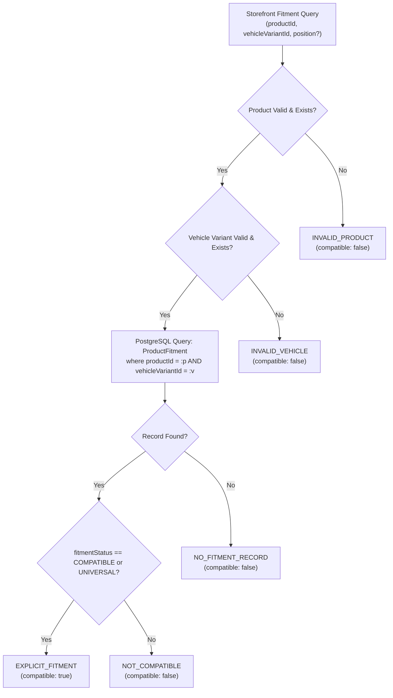

# Deterministic Fitment Engine (Phase M4)

## 1. Engine Objective & The Compatibility Question

The primary objective of the Deterministic Fitment Engine is to authoritatively, reliably, and testably answer the core automotive e-commerce question:

> **“อะไหล่นี้ใช้กับรถคันนี้ได้หรือไม่?” (Can this part fit this vehicle?)**



---

## 2. Fundamental Architectural Rule: Deterministic Truth vs. AI Candidates

### What Determines Compatibility:
- **Strict PostgreSQL Ground Truth**: Compatibility is determined **EXCLUSIVELY** by explicit records in the `product_fitments` table referencing a valid `VehicleVariant` ID.
- **Explainable & Verifiable**: Every positive fitment decision references the exact `ProductFitment` ID, mounting position, and engineering notes.

### What MUST NEVER Determine Compatibility:
1. ❌ **AI / LLM Reasoning**: LLMs can hallucinate part tolerances, year splits, and chassis variants. AI may propose candidate fitments for catalog manager review in future phases, but CAN NEVER make authoritative runtime decisions.
2. ❌ **Semantic Similarity / Vector Search**: High semantic embeddings between product title and vehicle name do NOT constitute mechanical fitment.
3. ❌ **Product Title / Description Text Matching**: Having "Toyota Yaris" in the title string does not guarantee fitment for XP150 1.2L vs XP150 1.5L vs XP210.
4. ❌ **OEM Reference Similarity**: Merely having similar OEM reference numbers without an explicit fitment record is rejected.
5. ❌ **Client-Side Inference**: JavaScript in the browser or Electron cannot declare compatibility.

---

## 3. Machine-Readable Reason Codes

Every fitment check API response returns a structured payload with an explicit, machine-readable reason code:

| Reason Code | `compatible` | Meaning / Trigger Condition |
| :--- | :---: | :--- |
| `EXPLICIT_FITMENT` | `true` | An explicit, active `ProductFitment` record exists in PostgreSQL with `COMPATIBLE` or `UNIVERSAL` status matching the variant and requested position. |
| `NO_FITMENT_RECORD` | `false` | Both product and vehicle are valid in PostgreSQL, but no fitment entry links them. |
| `INSUFFICIENT_VEHICLE_SPECIFICATION` | `false` | The vehicle is incomplete (e.g., make or model only without variant UUID). |
| `INVALID_PRODUCT` | `false` | The requested product ID or SKU does not exist or has been soft-deleted. |
| `INVALID_VEHICLE` | `false` | The requested vehicle variant UUID does not exist in the database. |

---

## 4. Fitment Data Structure & Constraints

### 4.1 Composite Uniqueness Constraint
To prevent duplicate and conflicting fitment definitions, the database enforces composite uniqueness:
```prisma
@@unique([productId, vehicleVariantId, position])
```
Attempting to create duplicate fitments for the same product, variant, and position returns HTTP `409 Conflict`.

### 4.2 Fitment Positions (`FitmentPosition` Enum)
- `ALL`: Fits any mounting location.
- `FRONT`: Front axle / assembly.
- `REAR`: Rear axle / assembly.
- `FRONT_LEFT`, `FRONT_RIGHT`: Specific front corners.
- `REAR_LEFT`, `REAR_RIGHT`: Specific rear corners.
- `INNER`, `OUTER`: Brake pad or tie rod inner/outer orientations.
- `UPPER`, `LOWER`: Control arm / suspension orientations.
- `UNIVERSAL`: Non-vehicle-specific / universal part.

### 4.3 Fitment Statuses (`FitmentStatus` Enum)
- `COMPATIBLE`: Part is verified to fit without modification.
- `INCOMPATIBLE`: Explicitly verified NOT to fit.
- `REQUIRES_MODIFICATION`: Fits only with adapter, bracket, or ECU tune (detailed in notes).
- `UNIVERSAL`: Standardized item (e.g. standard coolant, bulb type, fasteners).

---

## 5. Storefront Discovery & Server-Side Filtering

When a customer selects a vehicle on the storefront, the catalog queries:
```http
GET /api/v1/products?vehicleVariantId=76657969-7961-7269-7331-326c00000001&categoryId=...&brandId=...
```

The database repository translates this into an indexed relational `WHERE` clause:
```sql
WHERE products.is_active = true
  AND products.is_published = true
  AND products.deleted_at IS NULL
  AND EXISTS (
    SELECT 1 FROM product_fitments pf
    WHERE pf.product_id = products.id
      AND pf.vehicle_variant_id = $1
      AND pf.fitment_status = 'COMPATIBLE'
  )
```
This guarantees that **zero incompatible products** leak into the vehicle-filtered view.
