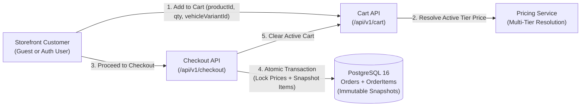

# Phase M6: Server-Authoritative Cart, Pricing Rules & Order Foundation

## 1. Domain Overview & Architecture

Phase M6 introduces the complete transactional shopping pipeline for the Intelligent Automotive E-Commerce platform:

---

## 2. Server-Authoritative Pricing Rules

| Customer Type | Price Tier | Resolution Logic | Fallback Rule |
| :--- | :--- | :--- | :--- |
| **Guest / Anonymous** | `GENERAL` | Standard retail gross catalog price | Lowest active price |
| **Retail Consumer** | `GENERAL` | Standard retail gross catalog price | Lowest active price |
| **Auto Repair Workshop** | `GARAGE` | Wholesale B2B garage tier discount | `GENERAL` |
| **Spare Parts Retailer** | `SHOP` | Distributor volume tier discount | `GENERAL` |

### Mathematical Rules:
1. **Line Total Calculation**: $\text{lineTotal} = \text{unitPrice} \times \text{quantity}$ (formatted to 2 decimal places).
2. **Shipping Rules**:
   - Orders $\ge 2,000.00\text{ THB} \implies \text{shippingFee} = 0.00\text{ THB}$ (Free Delivery).
   - Orders $< 2,000.00\text{ THB} \implies \text{shippingFee} = 50.00\text{ THB}$.
3. **Price Tampering Rejection**: Any monetary values sent in HTTP request bodies (e.g. `unitPrice`, `grandTotal`, `discountTotal`) are discarded by Zod schemas and replaced with server-side queries.

---

## 3. Session & Guest Cart Management

- **Guest Sessions**: Identified by a secure UUID session token transmitted via `X-Session-Token` HTTP header and `cart_session_token` HttpOnly cookie.
- **Cart Merging (`POST /api/v1/cart/merge`)**: When a guest logs in with an active session token, guest cart items are atomically merged with the authenticated user's persistent cart, and the guest cart record is removed.

---

## 4. Immutable Order Snapshotting

When an order is created, an immutable snapshot is written to `order_items`:
- `sku`: Immutable SKU at moment of purchase
- `productName`: Product name snapshot
- `unitPrice`: Resolved tier unit price
- `quantity`: Purchased quantity
- `lineTotal`: Total for the line
- `productSnapshot`: JSON containing brand, category, vehicle fitment configuration, and image URLs.
