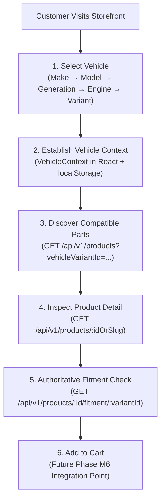
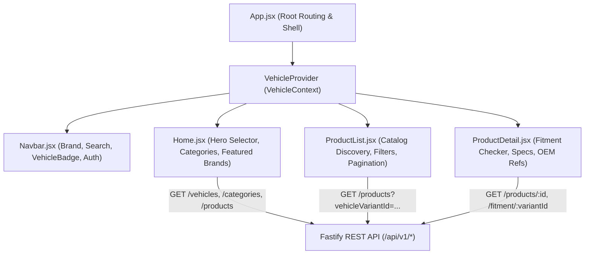

# Vehicle-Aware Storefront Architecture (Phase M5)

## 1. Storefront Mission & Customer Journey Flow

The Storefront domain provides the primary customer-facing interface for the Intelligent Automotive E-Commerce platform. Its architecture centers around a **vehicle-first shopping experience**:



---

## 2. Component Architecture & Data Flow



---

## 3. Vehicle Context State Management

Vehicle context is managed via `VehicleContext` (`src/context/VehicleContext.jsx`):
- **Stored Object**:
  ```json
  {
    "variantId": "7352f6e9-c5aa-4122-a770-582f4ef0a8d3",
    "makeId": "42747e51-7db5-47b8-8593-e775773124a6",
    "makeName": "Honda",
    "modelId": "b4ffa170-ec8a-437c-a3f2-b34d26291892",
    "modelName": "Civic",
    "generationId": "1cc3682b-4fce-4f60-b56d-a770f3a37d56",
    "generationName": "Civic FC (10th Gen)",
    "generationCode": "FC1/FK7",
    "engineId": "72d0021f-4fbe-465d-aeec-bbf2de425d90",
    "engineName": "1.5 VTEC Turbo",
    "engineCode": "L15BG",
    "variantName": "1.5 Turbo RS CVT",
    "transmission": "CVT",
    "yearRange": "2016-2021"
  }
  ```
- **Persistence**: Persisted in `localStorage` under key `mobex_selected_vehicle` so that customer selections persist across page refreshes and deep links.
- **Server Authority**: The frontend never computes compatibility. It passes `selectedVehicle.variantId` to the Fastify API, which enforces indexed SQL filtering.

---

## 4. Server-Authoritative Principles

1. **Pricing Authority**:
   - The frontend never calculates discounts, sale prices, or promotional totals.
   - It formats the server-provided `effectivePrice.amount` (in THB) and renders `compareAtPrice` if present.
2. **Compatibility Authority**:
   - The frontend renders results directly from `GET /api/v1/products/:id/fitment/:variantId`.
   - Positive compatibility renders `✓ ตรงรุ่นกับ [รถที่เลือก]` only when `compatible: true` with reason `EXPLICIT_FITMENT`.
3. **Inventory & Orders Boundary**:
   - Cart, Checkout, and Order snapshot foundation are actively implemented in Phase M6. Automated payment gateway webhooks and warehouse inventory reservations remain strictly scheduled for M7 and M10.

---

## 5. Decommissioning of Legacy SQLite IPC

In Phase M5 and M6, all customer-facing storefront pages (`Home.jsx`, `ProductList.jsx`, `ProductDetail.jsx`, `Checkout.jsx`, `OrderConfirmation.jsx`, `CartDrawer.jsx`) connect exclusively to `/api/v1` Fastify REST endpoints. All legacy mock arrays and Electron IPC dependencies have been permanently removed.

---

## 6. Verification Status & Evidence Standards

| Dimension | Verification Level | Status / Evidence |
| :--- | :--- | :--- |
| **5-Level Hierarchy API** | Automated Test | `AUTOMATED TEST VERIFIED` (15/15 M5 tests PASS) |
| **Vehicle Filtering** | Automated Test | `AUTOMATED TEST VERIFIED` (`scripts/m5-test.ts`) |
| **Deterministic Fitment Check** | Automated Test | `AUTOMATED TEST VERIFIED` (Matches M4 reason codes) |
| **Shopping Cart & Session Merging** | Automated Test | `AUTOMATED TEST VERIFIED` (18/18 M6 tests PASS) |
| **Server-Authoritative Pricing Rules** | Automated Test | `AUTOMATED TEST VERIFIED` (General, Garage, Shop tier tests PASS) |
| **Checkout & Immutable Order Snapshots** | Automated Test | `AUTOMATED TEST VERIFIED` (`scripts/m6-test.ts`) |
| **No Fake Commerce Data** | Code Review | `CODE REVIEW VERIFIED` (Zero mock reviews, fake stock, or artificial discounts) |
| **Accessibility Static Audit** | Code Review | `CODE REVIEW VERIFIED` (Semantic HTML, aria attributes, color contrast) |
| **Browser Visual & End-to-End QA** | Browser Environment | `BLOCKED BY ENVIRONMENT` (Playwright headless Chromium download blocked by Azure CDN) |

---

## 7. Roadmap Boundary

- **Phase Completed: M6 — Cart + Checkout + Server-Authoritative Pricing Rules & Order Foundation**
- **Next Phase: M7 — Payment Gateway Integration (PromptPay QR Dynamic Webhooks & Slip Verification)**
- **Shipping & Logistics:** Scheduled for **M8**
- **Orders & Fulfillment:** Scheduled for **M9**
- **Multi-Warehouse Inventory Management:** Scheduled for **M10**
