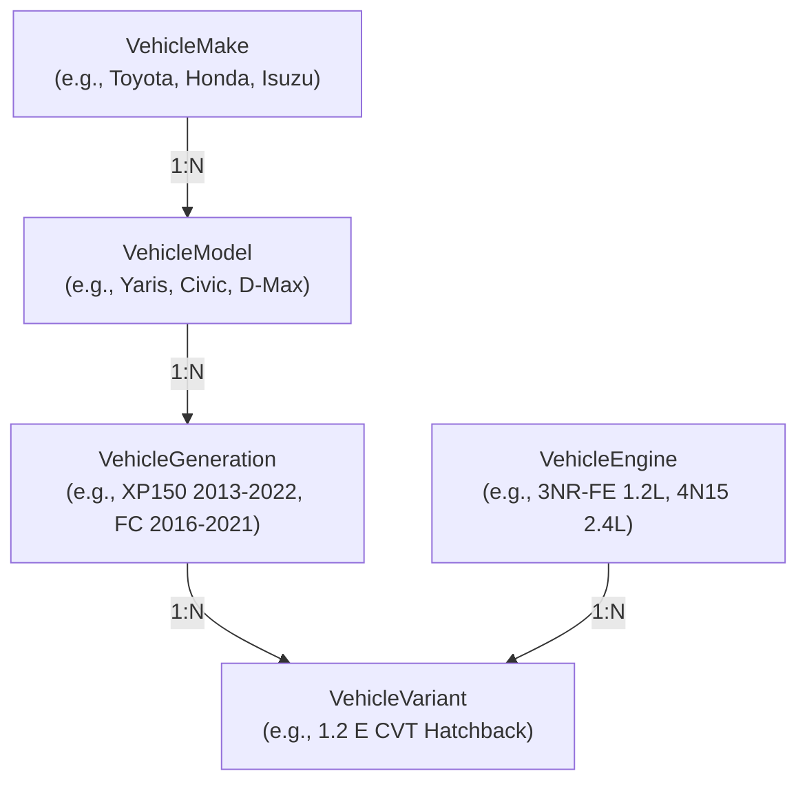

# Vehicle Master Data Architecture (Phase M4)

## 1. Overview & Architectural Principles

The Vehicle Hierarchy domain in the Automotive E-Commerce platform provides the authoritative structural foundation for identifying automobiles and establishing deterministic fitment records for catalog parts.

### Core Tenets
1. **Strict 5-Level Cascading Hierarchy**: Every fitment-target vehicle is modeled down to the `VehicleVariant` level, capturing generation body code, engine displacement/code, transmission, body type, drivetrain, and production year range.
2. **Normalized Master Data**: Vehicle makes, models, generations, and engines are independently normalized to eliminate data redundancy and prevent typographical anomalies.
3. **Referential Integrity & Cross-Hierarchy Validation**: Child records strictly validate that foreign key references exist in PostgreSQL before persistence.
4. **Deletion Safety**: Parent hierarchy nodes (Makes, Models, Generations, Engines) cannot be deleted if child entities or active fitment records depend on them.
5. **Zero Client-Side Inference**: All vehicle cascading lookups are executed server-side via Fastify REST endpoints (`/api/v1/vehicles/...`).

---

## 2. Hierarchy Levels & Specifications

| Level | Entity | Key Attributes | Example |
| :--- | :--- | :--- | :--- |
| **Level 1** | `VehicleMake` | `id`, `name`, `slug` (unique), `countryOfOrigin`, `logoUrl`, `isActive` | Toyota, Honda, Isuzu, Mitsubishi |
| **Level 2** | `VehicleModel` | `id`, `makeId`, `name`, `slug`, `isActive` | Yaris, Civic, D-Max, Fortuner, Pajero Sport |
| **Level 3** | `VehicleGeneration` | `id`, `modelId`, `name`, `code`, `startYear`, `endYear`, `isActive` | XP150 (2013–2022), FC (2016–2021), RG (2019–Present) |
| **Level 4** | `VehicleEngine` | `id`, `engineCode`, `name`, `displacementCc`, `cylinders`, `fuelType`, `aspiration` | 3NR-FE (1197cc Petrol NA), 4N15 (2442cc Diesel Turbo) |
| **Level 5** | `VehicleVariant` | `id`, `generationId`, `engineId`, `name`, `transmission`, `bodyType`, `drivetrain`, `startYear`, `endYear` | 1.2 G CVT Hatchback FWD (2017–2019) |

---

## 3. Cascading Selector Workflow (Storefront)

The storefront vehicle selector executes 5 sequential, lightweight queries:
1. `GET /api/v1/vehicles/makes` $\to$ Returns active makes (e.g. Toyota, Honda).
2. `GET /api/v1/vehicles/models?makeId=:makeId` $\to$ Returns models for the selected make.
3. `GET /api/v1/vehicles/generations?modelId=:modelId` $\to$ Returns generations with year spans and chassis codes.
4. `GET /api/v1/vehicles/engines?generationId=:generationId` $\to$ Returns engine options for the generation.
5. `GET /api/v1/vehicles/variants?generationId=:generationId&engineId=:engineId` $\to$ Resolves to specific variant UUID.

Once a `VehicleVariant` is selected:
- The catalog filters all product queries via `GET /api/v1/products?vehicleVariantId=:variantId`.
- Product detail pages verify compatibility via `GET /api/v1/products/:productId/fitment/:vehicleVariantId`.

---

## 4. RBAC & Security Boundary

- **Public Access (Storefront)**:
  - Read-only access to active vehicle makes, models, generations, engines, and variants.
- **Admin Access (`requirePermission`)**:
  - `vehicle.read`: View all vehicle master records including inactive ones.
  - `vehicle.create`: Create new makes, models, generations, engines, and variants.
  - `vehicle.update`: Modify vehicle specifications, codes, and active statuses.
  - `vehicle.delete`: Delete vehicle master records (guarded with deletion safety checks).
- **Audit Logging**:
  - All mutating actions record structured entries in `audit_logs` (`VEHICLE_MAKE_CREATED`, `VEHICLE_MODEL_UPDATED`, etc.).
