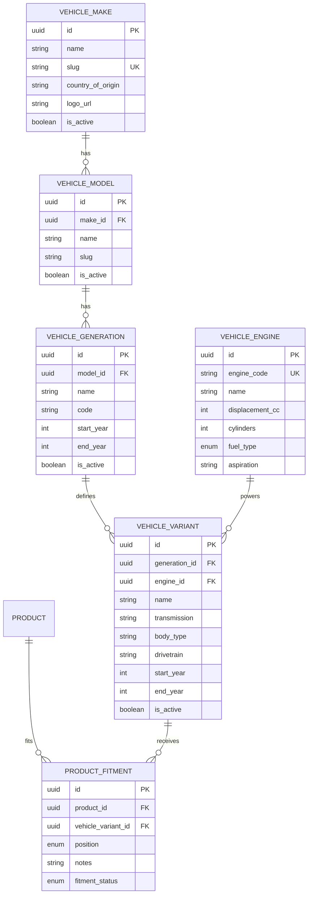

# Vehicle & Fitment Data Model Specification (Phase M4)

## 1. Relational Entity Diagram

---

## 2. Table Specifications & Indexes

### 2.1 `vehicle_makes`
- **Primary Key:** `id` (UUIDv4)
- **Unique Indexes:** `slug`
- **Columns:**
  - `name`: VARCHAR(100) NOT NULL
  - `slug`: VARCHAR(120) NOT NULL UNIQUE
  - `country_of_origin`: VARCHAR(100) NULL
  - `logo_url`: VARCHAR(500) NULL
  - `is_active`: BOOLEAN NOT NULL DEFAULT true
  - `created_at`, `updated_at`: TIMESTAMPTZ NOT NULL

### 2.2 `vehicle_models`
- **Primary Key:** `id` (UUIDv4)
- **Foreign Keys:** `make_id` $\to$ `vehicle_makes(id)` (ON DELETE RESTRICT)
- **Unique Indexes:** `[make_id, slug]`
- **Columns:**
  - `make_id`: UUID NOT NULL
  - `name`: VARCHAR(100) NOT NULL
  - `slug`: VARCHAR(120) NOT NULL
  - `is_active`: BOOLEAN NOT NULL DEFAULT true
  - `created_at`, `updated_at`: TIMESTAMPTZ NOT NULL

### 2.3 `vehicle_generations`
- **Primary Key:** `id` (UUIDv4)
- **Foreign Keys:** `model_id` $\to$ `vehicle_models(id)` (ON DELETE RESTRICT)
- **Indexes:** `[model_id, start_year, end_year]`
- **Columns:**
  - `model_id`: UUID NOT NULL
  - `name`: VARCHAR(100) NOT NULL
  - `code`: VARCHAR(50) NULL (Chassis code, e.g. "XP150", "FC", "RG")
  - `start_year`: INT NOT NULL
  - `end_year`: INT NULL
  - `is_active`: BOOLEAN NOT NULL DEFAULT true
  - `created_at`, `updated_at`: TIMESTAMPTZ NOT NULL

### 2.4 `vehicle_engines`
- **Primary Key:** `id` (UUIDv4)
- **Unique Indexes:** `engine_code` (nullable/unique where set)
- **Columns:**
  - `engine_code`: VARCHAR(50) NULL
  - `name`: VARCHAR(100) NOT NULL
  - `displacement_cc`: INT NULL
  - `cylinders`: INT NULL
  - `fuel_type`: ENUM (`PETROL`, `DIESEL`, `HYBRID`, `PLUG_IN_HYBRID`, `ELECTRIC`, `CNG_LPG`) NOT NULL DEFAULT `PETROL`
  - `aspiration`: VARCHAR(50) NULL (e.g., "Naturally Aspirated", "Turbocharged", "Twin-Turbo")
  - `created_at`, `updated_at`: TIMESTAMPTZ NOT NULL

### 2.5 `vehicle_variants`
- **Primary Key:** `id` (UUIDv4)
- **Foreign Keys:**
  - `generation_id` $\to$ `vehicle_generations(id)` (ON DELETE RESTRICT)
  - `engine_id` $\to$ `vehicle_engines(id)` (ON DELETE RESTRICT)
- **Indexes:** `[generation_id, engine_id]`
- **Columns:**
  - `generation_id`: UUID NOT NULL
  - `engine_id`: UUID NULL
  - `name`: VARCHAR(150) NOT NULL
  - `transmission`: VARCHAR(50) NULL (e.g., "CVT", "6MT", "6AT", "8AT")
  - `body_type`: VARCHAR(50) NULL (e.g., "Hatchback", "Sedan", "SUV", "Double Cab")
  - `drivetrain`: VARCHAR(50) NULL (e.g., "FWD", "RWD", "4WD", "AWD")
  - `start_year`: INT NULL
  - `end_year`: INT NULL
  - `is_active`: BOOLEAN NOT NULL DEFAULT true
  - `created_at`, `updated_at`: TIMESTAMPTZ NOT NULL

### 2.6 `product_fitments`
- **Primary Key:** `id` (UUIDv4)
- **Foreign Keys:**
  - `product_id` $\to$ `products(id)` (ON DELETE CASCADE)
  - `vehicle_variant_id` $\to$ `vehicle_variants(id)` (ON DELETE RESTRICT)
- **Unique Indexes:** `[product_id, vehicle_variant_id, position]`
- **Performance Indexes:**
  - `[vehicle_variant_id, fitment_status]` (Fast reverse lookup for variant products)
  - `[product_id, fitment_status]` (Fast forward lookup for product vehicle list)
- **Columns:**
  - `product_id`: UUID NOT NULL
  - `vehicle_variant_id`: UUID NOT NULL
  - `position`: ENUM (`ALL`, `FRONT`, `REAR`, `FRONT_LEFT`, `FRONT_RIGHT`, `REAR_LEFT`, `REAR_RIGHT`, `INNER`, `OUTER`, `UPPER`, `LOWER`, `UNIVERSAL`) NOT NULL DEFAULT `ALL`
  - `notes`: TEXT NULL
  - `fitment_status`: ENUM (`COMPATIBLE`, `INCOMPATIBLE`, `REQUIRES_MODIFICATION`, `UNIVERSAL`) NOT NULL DEFAULT `COMPATIBLE`
  - `created_at`, `updated_at`: TIMESTAMPTZ NOT NULL
