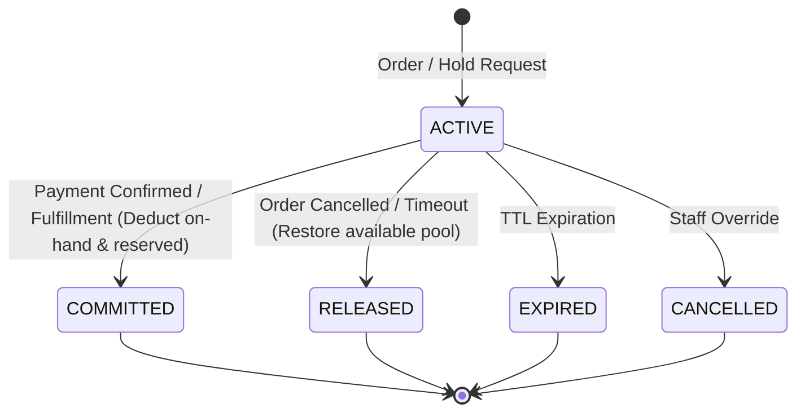

# Stock Reservation Lifecycle

## 1. Lifecycle State Machine

## 2. Transition Rules

### `reserveStock`
- Locks `inventory_items` row.
- Checks $onHand - reserved \ge requestedQty$.
- Increments `reserved` by $requestedQty$.
- Creates `StockReservation` with status `ACTIVE`.
- Appends `StockMovement` of type `RESERVATION`.

### `commitReservation`
- Verifies reservation is `ACTIVE` (idempotent if already `COMMITTED`).
- Decrements `onHand` by $quantity$.
- Decrements `reserved` by $quantity$.
- Updates status to `COMMITTED`.
- Appends `StockMovement` of type `DEDUCTION`.

### `releaseReservation`
- Verifies reservation is `ACTIVE` (idempotent if already `RELEASED`).
- Decrements `reserved` by $quantity$ (restoring available stock).
- Updates status to `RELEASED`.
- Appends `StockMovement` of type `RELEASE`.
