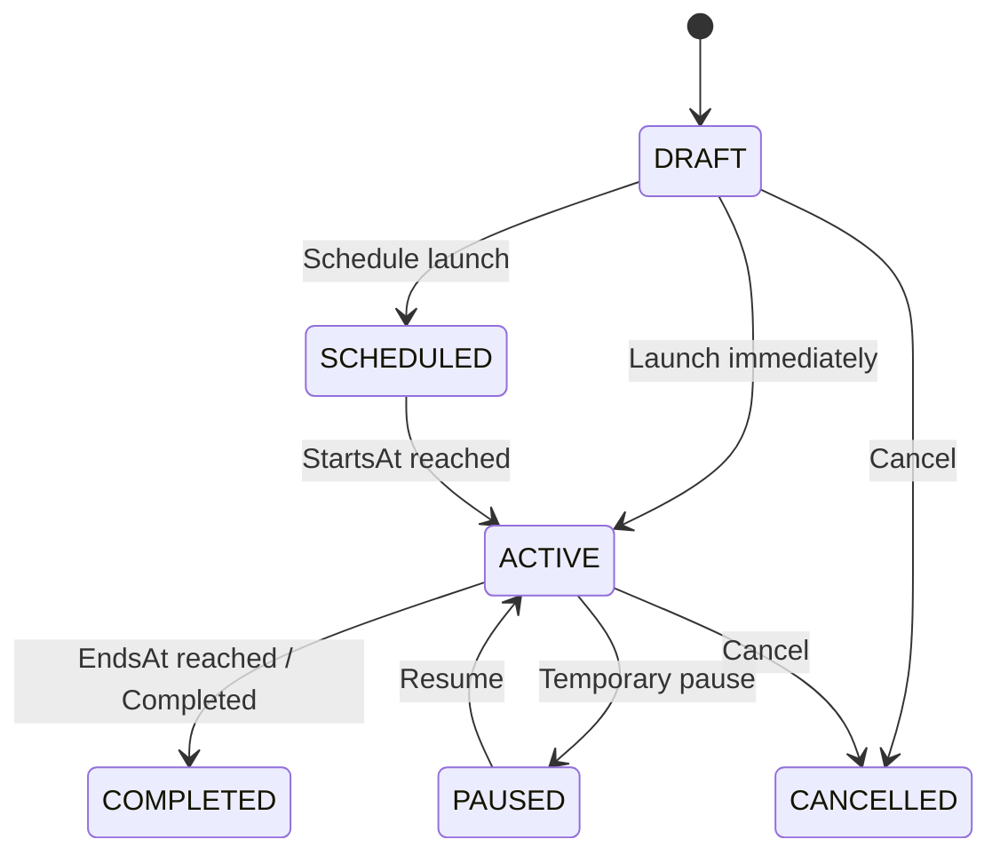

# Marketing Campaigns & Audience Targeting Foundation

## 1. Domain Objective
The Marketing Campaign domain connects CRM Customer Segments with promotional events, tracking campaign progression, audience reach, customer engagement, and order conversions.

## 2. Campaign Lifecycle

## 3. Audience Targeting & Conversion Tracking
- **Segment Targeting**: Campaigns link to `CustomerSegment`. Upon activation, `CampaignAudience` records are created for all qualifying customers.
- **Interaction Events**: `CampaignEvent` records customer interactions (`VIEW`, `CLICK`, `CONVERT`).
- **Attribution**: Converted orders update `totalRevenue` and `discountCost` metrics on the campaign master record.
- **Provider Isolation**: Phase M12 implements internal campaign master data and attribution without pretending external email/SMS providers are connected.
