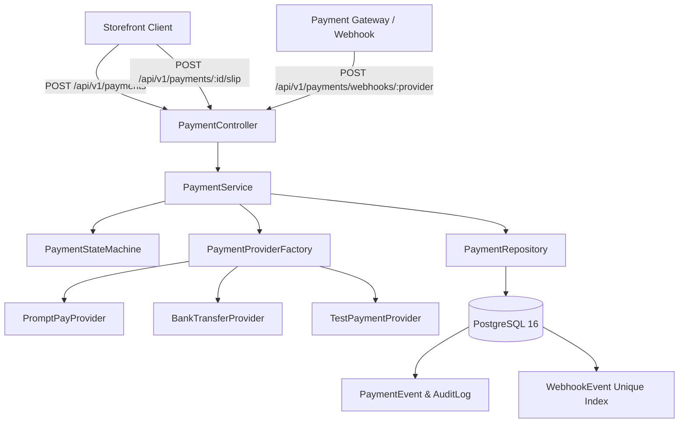

# Payment Architecture Specification (Phase M7)

## 1. Overview
The Payment Domain provides a **server-authoritative, auditable, idempotent, and secure payment lifecycle** for the Intelligent Automotive E-Commerce platform. It manages transactions from payment draft creation through provider webhook settlements, bank transfer slip verification workflows, and refund processing.

---

## 2. Core Architectural Principles

### Principle 1: Absolute Server-Side Financial Authority
The frontend client is strictly forbidden from dictating or altering:
- Payment amounts
- Currencies (enforced to `THB`)
- Payment references
- Payment statuses
- Settlement confirmations
- Refund calculations

The authoritative flow is:
$$\text{Database Order} \longrightarrow \text{Server-Calculated Grand Total} \longrightarrow \text{Payment Service} \longrightarrow \text{Provider / Verified Slip} \longrightarrow \text{Atomic State Transition}$$

### Principle 2: Strict Payment $\longleftrightarrow$ Order Boundary
- Order placement in M6 creates `Order.status = PENDING_PAYMENT` and `Payment.status = PENDING`.
- Selecting a payment method or opening a PromptPay QR code **does not** mark an order as paid.
- Only verified cryptographic webhook receipts or staff-approved bank transfer slips transition `Payment.status = PAID` and `Order.status = PAYMENT_CONFIRMED`.

---

## 3. Component Architecture

---

## 4. Entity Relational Schema

- **`Payment`**: Core transaction record holding `internalReference` (`PAY-YYYYMMDD-XXXXX`), `idempotencyKey`, `status`, `amount`, `currency`, `providerReference`, and `metadata`.
- **`PaymentEvent`**: Append-only immutable audit trail recording every state change, actor, reason, webhook payload, and timestamps.
- **`PaymentTransaction`**: Individual financial charge, capture, auth, or refund interaction with external gateways.
- **`PaymentRefund`**: Detailed refund records linked to parent payment with cumulative sum validation.
- **`WebhookEvent`**: Dedicated deduplication table with composite unique constraint `@@unique([provider, eventId])` guaranteeing 100% replay protection.
- **`PaymentSlip`**: Customer bank transfer slip uploads with review status (`PENDING_REVIEW`, `VERIFIED`, `REJECTED`).
