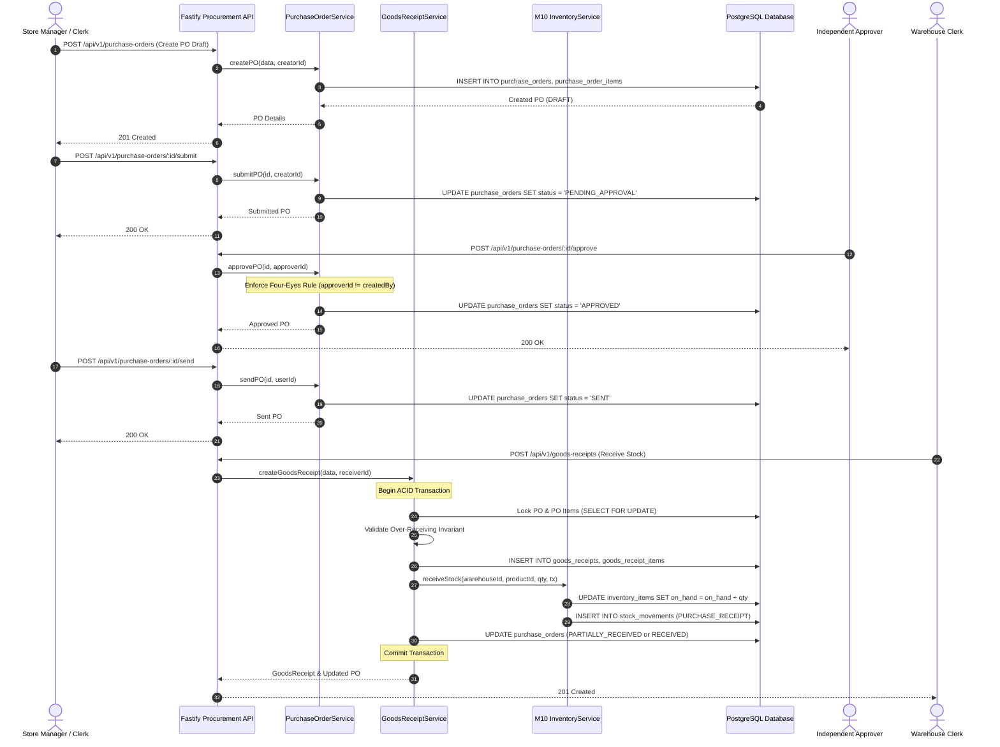

# Phase M11: Procurement & Supply Chain Architecture

## 1. Executive Summary

Phase M11 introduces the authoritative **Supplier & Procurement Management** domain for the Automotive Parts E-Commerce & Business Management Platform.

M11 bridges external automotive parts manufacturers, distributors, and suppliers with the internal catalog, order management, and warehouse inventory systems.

```
+-------------------------------------------------------------+
|                     Suppliers & Vendors                     |
+-------------------------------------------------------------+
                              |
                              v
+-------------------------------------------------------------+
|             M11: Supplier & Procurement Management          |
|  - Supplier Master Data & Contacts                          |
|  - Supplier Product Mapping & Purchasing Costs (MOQ/Lead)   |
|  - Purchase Order State Machine & Approval (Four-Eyes)      |
|  - Goods Receipt Processing (Partial / Full / Reject)       |
+-------------------------------------------------------------+
                              |
                              | Atomic Transaction via
                              | InventoryService.receiveStock()
                              v
+-------------------------------------------------------------+
|             M10: Inventory & Warehouse Domain               |
|  - Warehouses & Bins                                        |
|  - InventoryItem (onHand, reserved, available)              |
|  - Immutable StockMovement Ledger (PURCHASE_RECEIPT)        |
+-------------------------------------------------------------+
```

---

## 2. Core Architectural Principles

1. **Server-Authoritative Domain**:
   - All procurement state transitions, tax/total calculations, and receipt validations execute exclusively in the backend Fastify API.
   - Frontend components are strictly presentation layers.

2. **M10 Inventory Authority Preservation**:
   - M11 never directly writes to `InventoryItem` or `StockMovement` tables.
   - All physical receiving operations delegate directly to M10's `InventoryService.receiveStock(..., tx)` with PostgreSQL row-level locks (`SELECT ... FOR UPDATE`).

3. **Deterministic State Machine**:
   - `PurchaseOrder` follows a strict unidirectional state lifecycle managed by `PurchaseOrderStateMachine`.
   - Out-of-order transitions, illegal reversions, and duplicate submissions are rejected with structured domain errors.

4. **Four-Eyes Principle (Separation of Duties)**:
   - High-value purchasing requires approval by an independent staff member (`approverId !== createdBy`).
   - `SUPER_ADMIN` self-approval overrides are permitted for emergency single-operator scenarios and explicitly audit-logged.

5. **Immutable Historical Snapshots**:
   - Purchase order items freeze unit purchasing costs, supplier SKU codes, and tax rates at order creation.
   - Master catalog changes or vendor price updates never alter historical PO lines or accounting records.

---

## 3. Component Architecture & Data Flow



---

## 4. Key Directory & File Index

| Component | Path | Responsibility |
|---|---|---|
| **Prisma Schema** | `prisma/schema.prisma` | Relational models (`Supplier`, `SupplierProduct`, `PurchaseOrder`, `PurchaseOrderItem`, `GoodsReceipt`, `GoodsReceiptItem`) |
| **Repositories** | `apps/api/src/repositories/supplier.repository.ts` | Supplier CRUD & pagination |
| | `apps/api/src/repositories/supplier-product.repository.ts` | Product mapping, single preferred supplier rules |
| | `apps/api/src/repositories/purchase-order.repository.ts` | PO persistence, row locking, sequence generators |
| | `apps/api/src/repositories/goods-receipt.repository.ts` | GRN persistence, sequence generators |
| **Services** | `apps/api/src/services/purchase-order-state-machine.ts` | Validates PO lifecycle state transitions |
| | `apps/api/src/services/supplier.service.ts` | Supplier master business logic & code normalization |
| | `apps/api/src/services/supplier-product.service.ts` | Vendor-catalog mappings, MOQ, lead times, pricing |
| | `apps/api/src/services/purchase-order.service.ts` | PO lifecycle, financial calculations, four-eyes approval |
| | `apps/api/src/services/goods-receipt.service.ts` | Atomic receiving, over-receiving validation, M10 delegation |
| **Schemas** | `apps/api/src/schemas/supplier.schema.ts` | Zod validation schemas for suppliers & mappings |
| | `apps/api/src/schemas/purchase-order.schema.ts` | Zod schemas for PO creation, items, and status transitions |
| | `apps/api/src/schemas/goods-receipt.schema.ts` | Zod schemas for goods receipts |
| **Controllers & Routes** | `apps/api/src/controllers/` & `apps/api/src/routes/` | RESTful endpoints for procurement domain |
| **Frontend UI** | `src/components/admin/ProcurementManager.jsx` | Staff dashboard for vendors, POs, and GRNs |
| **Test Suite** | `scripts/m11-test.ts` | 45 comprehensive end-to-end integration tests |
