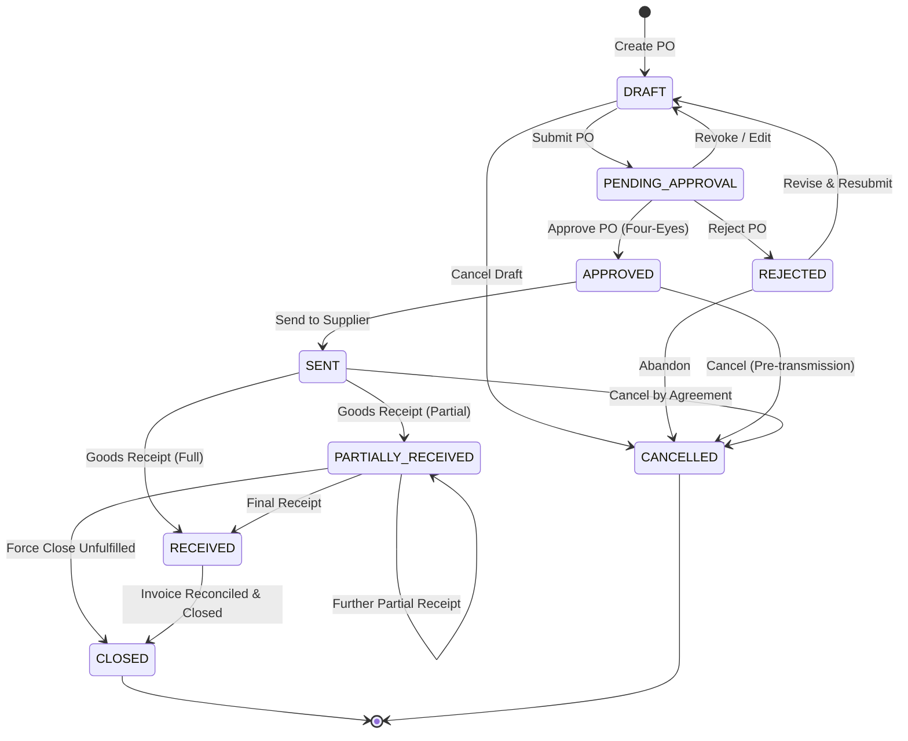

# Purchase Order Lifecycle & State Machine

## 1. Overview

The `PurchaseOrder` lifecycle governs the end-to-end procurement workflow from initial draft requisition through managerial review, supplier transmission, warehouse receipt, and financial closure.

---

## 2. State Transition Diagram



---

## 3. Allowed Transitions Matrix

| From Status | Permitted Target Statuses | Trigger Action | Required Role | Invariants Enforced |
|---|---|---|---|---|
| `DRAFT` | `PENDING_APPROVAL`, `CANCELLED` | `submitPO`, `cancelPO` | `STORE_MANAGER`, `INVENTORY_CLERK` | Must have $\ge 1$ item |
| `PENDING_APPROVAL` | `APPROVED`, `REJECTED`, `DRAFT` | `approvePO`, `rejectPO`, `revertPO` | `STORE_MANAGER`, `SUPER_ADMIN` | `approverId !== createdBy` (unless SUPER_ADMIN override) |
| `REJECTED` | `DRAFT`, `CANCELLED` | `revisePO`, `cancelPO` | `STORE_MANAGER`, `INVENTORY_CLERK` | Requires rejection reason |
| `APPROVED` | `SENT`, `CANCELLED` | `sendPO`, `cancelPO` | `STORE_MANAGER`, `INVENTORY_CLERK` | Locked line items |
| `SENT` | `PARTIALLY_RECEIVED`, `RECEIVED`, `CANCELLED` | `createGoodsReceipt`, `cancelPO` | `INVENTORY_CLERK`, `STORE_MANAGER` | Receiving via M10 `InventoryService` |
| `PARTIALLY_RECEIVED` | `PARTIALLY_RECEIVED`, `RECEIVED`, `CLOSED` | `createGoodsReceipt`, `closePO` | `INVENTORY_CLERK`, `STORE_MANAGER` | $0 < \text{receivedQty} \le \text{orderedQty}$ |
| `RECEIVED` | `CLOSED` | `closePO` | `STORE_MANAGER`, `ACCOUNTANT` | All items 100% received |
| `CANCELLED` / `CLOSED` | None (Terminal) | - | - | Immutable |

---

## 4. State Machine Implementation Details

The state machine is implemented in [`apps/api/src/services/purchase-order-state-machine.ts`](file:///Users/ibookky/Catalogue/car-parts-catalog/apps/api/src/services/purchase-order-state-machine.ts):

```typescript
export class PurchaseOrderStateMachine {
  private static readonly VALID_TRANSITIONS: Record<PurchaseOrderStatus, PurchaseOrderStatus[]> = {
    [PurchaseOrderStatus.DRAFT]: [
      PurchaseOrderStatus.PENDING_APPROVAL,
      PurchaseOrderStatus.CANCELLED,
    ],
    [PurchaseOrderStatus.PENDING_APPROVAL]: [
      PurchaseOrderStatus.APPROVED,
      PurchaseOrderStatus.REJECTED,
      PurchaseOrderStatus.DRAFT,
    ],
    [PurchaseOrderStatus.REJECTED]: [
      PurchaseOrderStatus.DRAFT,
      PurchaseOrderStatus.CANCELLED,
    ],
    [PurchaseOrderStatus.APPROVED]: [
      PurchaseOrderStatus.SENT,
      PurchaseOrderStatus.CANCELLED,
    ],
    [PurchaseOrderStatus.SENT]: [
      PurchaseOrderStatus.PARTIALLY_RECEIVED,
      PurchaseOrderStatus.RECEIVED,
      PurchaseOrderStatus.CANCELLED,
    ],
    [PurchaseOrderStatus.PARTIALLY_RECEIVED]: [
      PurchaseOrderStatus.PARTIALLY_RECEIVED,
      PurchaseOrderStatus.RECEIVED,
      PurchaseOrderStatus.CLOSED,
    ],
    [PurchaseOrderStatus.RECEIVED]: [
      PurchaseOrderStatus.CLOSED,
    ],
    [PurchaseOrderStatus.CANCELLED]: [],
    [PurchaseOrderStatus.CLOSED]: [],
  };

  static validateTransition(currentStatus: PurchaseOrderStatus, targetStatus: PurchaseOrderStatus): void {
    const allowed = this.VALID_TRANSITIONS[currentStatus] || [];
    if (!allowed.includes(targetStatus)) {
      throw new Error(`Invalid PO state transition from ${currentStatus} to ${targetStatus}`);
    }
  }
}
```

---

## 5. Four-Eyes Separation of Duties

To prevent fraud and unauthorized commitments:
- When a Purchase Order transitions to `APPROVED`, the approving user must be distinct from the user who created the draft (`createdBy !== approverId`).
- Attempted self-approval by a standard Store Manager throws `403 Forbidden` with error code `PO_APPROVAL_SEPARATION_OF_DUTIES`.
- `SUPER_ADMIN` users can execute an emergency override, which logs an explicit audit event.
