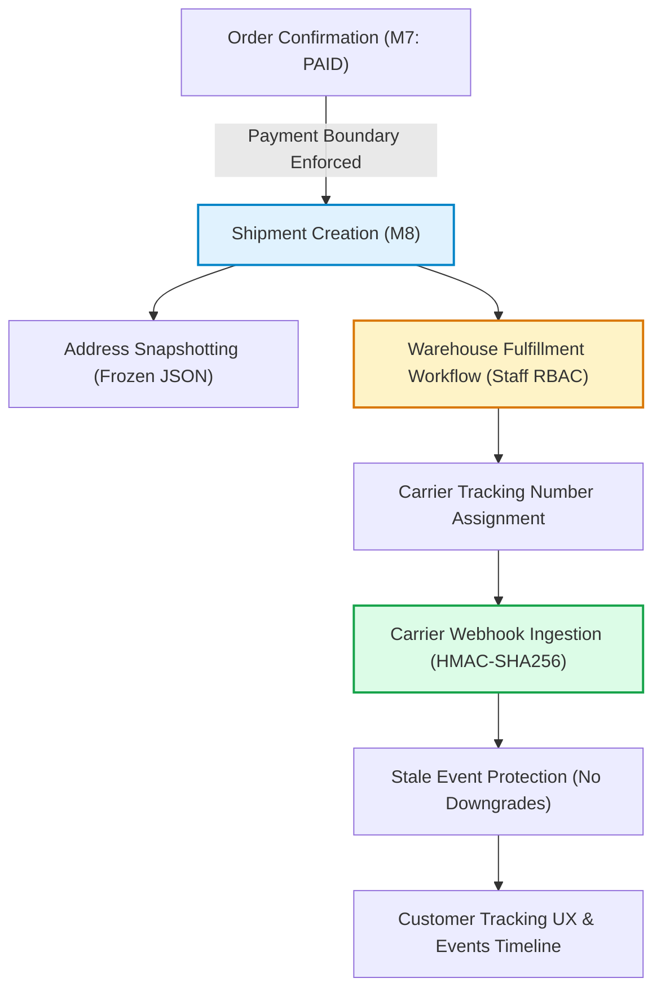
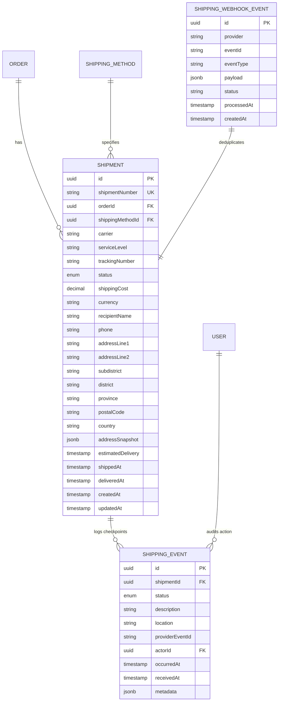

# Shipping & Fulfillment Architecture (Phase M8)

## 1. Executive Summary
Phase M8 implements the **Shipping Integration & Fulfillment Workflow** for the Intelligent Automotive E-Commerce platform (`iBookky/Autoparts-Data`).

The shipping subsystem bridges confirmed financial orders (`PAYMENT_CONFIRMED` / `COD`) with physical logistics couriers (Flash Express, Kerry Express, SCG Express, Lalamove), providing immutable address snapshots, strict state machine transitions, append-only checkpoint tracking, out-of-order webhook protection, and customer tracking UX.

---

## 2. Architectural Boundaries & Non-Goals

### Critical Boundaries
1. **Strict Payment Boundary:**
   - Orders in status `PENDING_PAYMENT` cannot enter fulfillment.
   - `POST /api/v1/shipments` explicitly checks `order.status in [PAYMENT_CONFIRMED, PROCESSING, READY_FOR_SHIPMENT, SHIPPED, DELIVERED]` or authorized COD.
2. **Zero Inventory / Warehouse Stock Mutation:**
   - M8 does NOT reserve, allocate, deduct, or mutate warehouse stock quantities in `InventoryItem` or ledger movements in `StockMovement`.
   - Inventory reservation, bin allocation, pick-and-pack routing, and batch deduction are strictly deferred to **Phase M10 (Inventory & Warehouse Management)**.
3. **Zero Historical Financial Mutation:**
   - Fulfillment operations never alter order financial values (`subtotal`, `grandTotal`, `shippingTotal`, `OrderItem.unitPrice`).
   - Shipping rates are resolved server-side from `ShippingMethod.basePrice`.

---

## 3. Database Domain Models

---

## 4. Security & Privacy Controls
1. **IDOR Protection:**
   - Customers can only query shipments belonging to their own customer profile (`order.customerId === user.customerProfile.id`).
   - Cross-tenant shipment queries return `403 Forbidden`.
2. **Public Tracking Privacy Masking:**
   - Unauthenticated customer tracking lookup (`GET /api/v1/tracking/:trackingNumber`) masks recipient names (e.g., `Somchai S.`) and phone numbers (`081-XXX-5678`).
3. **Webhook Cryptographic Authentication:**
   - Carrier webhooks require valid `HMAC-SHA256` signatures verified via timing-safe byte comparison (`crypto.timingSafeEqual`).
4. **Replay & Timestamp Protection:**
   - Timestamp headers exceeding 300 seconds skew are rejected.
   - Provider event IDs are recorded with `@@unique([provider, eventId])` to safely absorb webhook re-deliveries.
