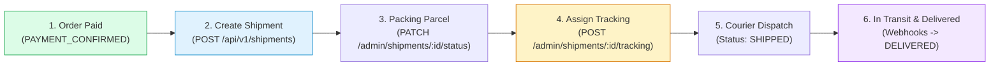

# Warehouse Staff Fulfillment Workflow

## 1. Fulfillment Stages Overview

---

## 2. Staff RBAC Permissions
Fulfillment actions require authenticated staff roles (`SUPER_ADMIN`, `ADMIN`, `SALES_REP`, `WAREHOUSE`):

| Endpoint | Role Required | Description |
| :--- | :--- | :--- |
| `GET /api/v1/admin/shipments` | `ADMIN`, `WAREHOUSE`, `SALES_REP` | List shipments with status & carrier filters |
| `PATCH /api/v1/admin/shipments/:id/status` | `ADMIN`, `WAREHOUSE` | Transition status (`READY_TO_FULFILL`, `PACKING`, `SHIPPED`) |
| `POST /api/v1/admin/shipments/:id/tracking` | `ADMIN`, `WAREHOUSE` | Assign carrier tracking number |
| `POST /api/v1/admin/shipments/:id/cancel` | `ADMIN`, `WAREHOUSE` | Cancel shipment prior to dispatch |

---

## 3. Order Status Synchronization
When warehouse staff update shipment status:
1. `READY_TO_SHIP` $\to$ Synchronizes `Order.status = READY_FOR_SHIPMENT`
2. `SHIPPED` $\to$ Synchronizes `Order.status = SHIPPED` and stamps `shippedAt`
3. `DELIVERED` $\to$ Synchronizes `Order.status = DELIVERED` and stamps `deliveredAt`
