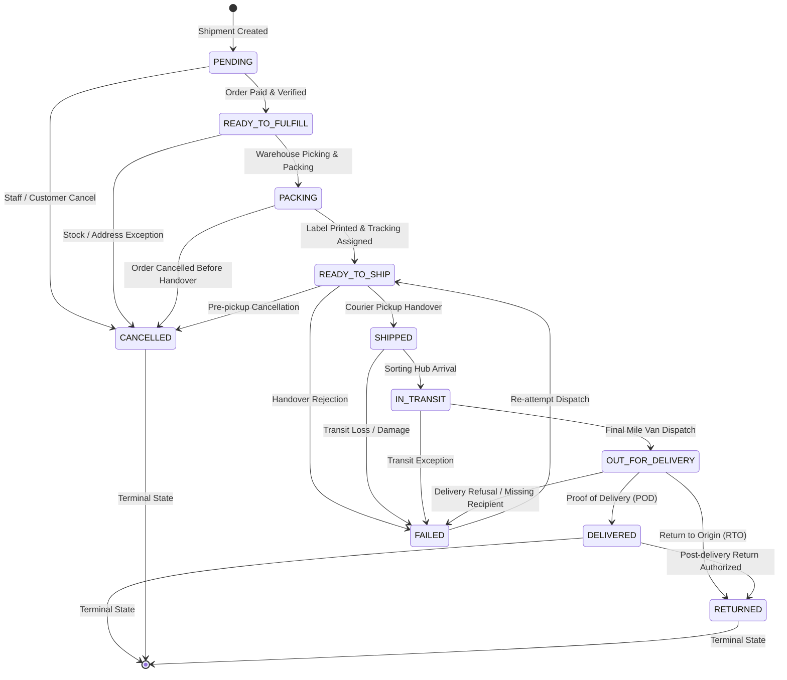

# Shipment State Machine & Lifecycle Transitions

## 1. Overview
The `ShipmentStateMachine` enforces strict, unidirectional transitions across warehouse fulfillment stages and courier transit milestones, preventing invalid skips and handling out-of-order webhook delivery.

---

## 2. State Transition Graph

---

## 3. Legal Transitions Matrix

| From Status | Allowed Next Statuses | Order Status Synchronization | Description |
| :--- | :--- | :--- | :--- |
| `PENDING` | `READY_TO_FULFILL`, `PICKED`, `PACKING`, `CANCELLED` | Unchanged (`PAYMENT_CONFIRMED`) | Shipment initialized |
| `READY_TO_FULFILL` | `PICKED`, `PACKING`, `CANCELLED` | Unchanged | Allocated for packing |
| `PICKED` | `PACKING`, `PACKED`, `READY_TO_SHIP`, `CANCELLED` | `PROCESSING` | Items picked from bins |
| `PACKING` | `PACKED`, `READY_TO_SHIP`, `CANCELLED` | `PROCESSING` | Parcel boxed & taped |
| `PACKED` | `READY_TO_SHIP`, `HANDED_OVER`, `SHIPPED`, `CANCELLED` | `PROCESSING` | Weight verified |
| `READY_TO_SHIP` | `HANDED_OVER`, `SHIPPED`, `FAILED`, `CANCELLED` | `READY_FOR_SHIPMENT` | Tracking assigned & manifest printed |
| `HANDED_OVER` | `SHIPPED`, `IN_TRANSIT`, `OUT_FOR_DELIVERY`, `DELIVERED`, `FAILED` | `SHIPPED` | Transferred to driver |
| `SHIPPED` | `IN_TRANSIT`, `OUT_FOR_DELIVERY`, `DELIVERED`, `FAILED` | `SHIPPED` | In courier custody |
| `IN_TRANSIT` | `OUT_FOR_DELIVERY`, `DELIVERED`, `FAILED` | `SHIPPED` | Moving through regional hubs |
| `OUT_FOR_DELIVERY` | `DELIVERED`, `FAILED`, `RETURNED` | `SHIPPED` | Courier on final delivery route |
| `DELIVERED` | `RETURNED` | `DELIVERED` | Customer signed POD |
| `FAILED` | `READY_TO_SHIP` | `PROCESSING` | Re-delivery scheduled |
| `RETURNED` | *(Terminal)* | `CANCELLED` | Returned to warehouse |
| `CANCELLED` | *(Terminal)* | `CANCELLED` | Shipment cancelled |

---

## 4. Stale Event & Out-of-Order Webhook Protection
Courier webhooks sent across public networks may arrive out-of-order (e.g. an `IN_TRANSIT` update arrives 10 minutes *after* `DELIVERED`).

`ShipmentStateMachine.isStaleEvent(currentStatus, incomingStatus)` evaluates status hierarchy ranking:
1. `DELIVERED` status is strictly protected: incoming `IN_TRANSIT` or `SHIPPED` events are marked `PROCESSED` without downgrading the shipment record.
2. If `incomingRank < currentRank`, the database update is bypassed safely, preserving audit history.
