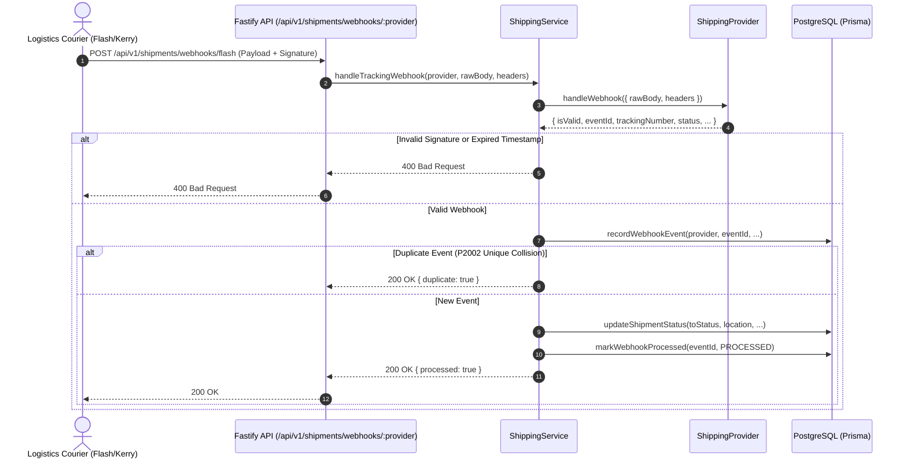

# Inbound Courier Tracking Webhooks

## 1. Webhook Pipeline Overview
Logistics couriers send push notifications as parcels progress through checkpoints.



---

## 2. Inbound Webhook Endpoint Specification

- **Method:** `POST`
- **Path:** `/api/v1/shipments/webhooks/:provider`
- **Supported Providers:** `flash`, `kerry`, `test`, `scg`
- **Headers:**
  - `Content-Type: application/json`
  - `x-signature` or `x-flash-signature` or `x-shipping-signature`: `HMAC-SHA256` signature
  - `x-timestamp` or `x-request-timestamp`: Unix timestamp (seconds)

### Request Payload Sample
```json
{
  "eventId": "EVT-FLASH-987654321",
  "eventType": "STATUS_UPDATE",
  "trackingNumber": "TH0123456789F",
  "status": "IN_TRANSIT",
  "description": "พัสดุถึงศูนย์กระจายสินค้าหลัก รังสิต",
  "location": "ศูนย์กระจายสินค้ารังสิต Hub 01",
  "occurredAt": "2026-09-08T10:30:00.000Z"
}
```

---

## 3. Webhook Deduplication & Idempotency Strategy
1. **PostgreSQL Composite Unique Key:** `@@unique([provider, eventId])` in `shipping_webhook_events`.
2. **Graceful Collision Handling:** If duplicate webhook events arrive in parallel, Prisma `P2002` collision is caught, existing record is returned, and status `200 OK { duplicate: true }` is returned with zero duplicated database mutations.
